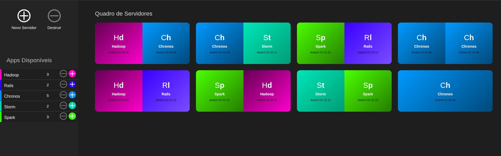

# ClusterFlow

Simulador visual de cluster para iniciar/parar instancias de apps e distribuir carga entre servidores.

## Preview do painel

## O que o projeto faz

Painel para:
- Criar e destruir servidores.
- Iniciar e parar instancias de apps pre-definidos (Hadoop, Rails, Chronos, Storm, Spark).
- Mostrar em tempo real quantas instancias de cada app estao em execucao.
- Exibir cada instancia no servidor com sigla, nome e horario de adicao.

## Regras implementadas (analise do codigo)

A logica principal esta na store Pinia [`src/cluster.js`]

- Estado inicial:
  - `iniciarCluster()` cria **4 servidores**.
- Capacidade por servidor:
  - Cada servidor aceita no maximo **2 apps**.
  - Isso acontece porque a alocacao so usa servidores com `0` ou `1` app.
- Estrategia de alocacao:
  - `alocacaoApp(app)` primeiro tenta servidor vazio, depois servidor com 1 app.
  - Se todos tiverem 2 apps, a instancia nao sobe.
- Falha de alocacao:
  - `iniciarInstancia()` mostra alerta quando nao ha capacidade.
- Parada de instancia:
  - `pararInstancia()` remove a **ultima ocorrencia encontrada** do app (varre servidores de tras para frente).
- Remocao de servidor:
  - `destruirServidor()` remove o ultimo servidor criado (efeito tipo pilha/LIFO).
  - Apps do servidor removido sao realocados seguindo as mesmas regras; se nao couberem, sao perdidos silenciosamente.

## Decisoes de produto e UX percebidas

- Sidebar fixa concentra comandos operacionais (novo servidor, destruir, iniciar/parar apps).
- Area principal funciona como quadro de observacao do cluster.
- Paleta por app melhora leitura rapida no painel e nos cards.
- Registro de horario (`Added HH:MM:SS`) ajuda a visualizar ordem de entrada das instancias.
- Ha ajustes de responsividade para telas menores no `ClusterView.vue`.

## Stack

- Vue 3 (Composition API)
- Pinia (estado global do cluster)
- Vite

## Como rodar

1. Instale dependencias:
   - `npm install`
2. Execute em desenvolvimento:
   - `npm run dev`
3. Abra:
   - `http://localhost:5173`

## Estrutura principal

- [`src/cluster.js`]: regras de negocio e alocacao.
- [`src/views/ClusterView.vue`]: layout, controles e integracao com store.
- [`src/components/ServerGrid.vue`]: grade de servidores.
- [`src/components/ServerCard.vue`]: renderizacao das instancias em cada servidor.